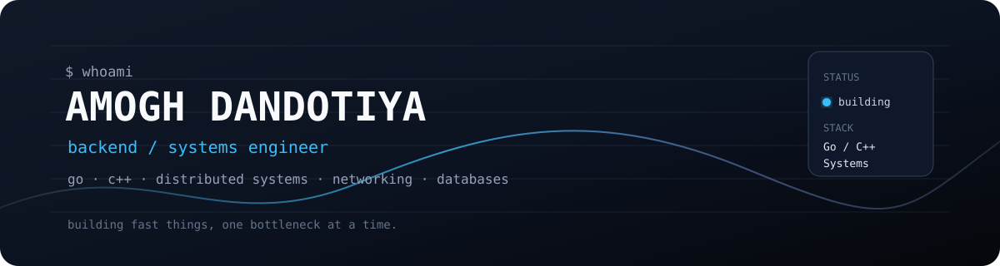

  

# Hi, I'm Amogh Dandotiya 👋

### Backend & Systems Engineer

Building backend infrastructure, high-performance systems, and developer-focused software with **Go and C++**.

Interested in **distributed systems, concurrency, networking, databases, and systems programming**.

---

## About Me

* 🎓 CSE undergraduate at **IIIT Kalyani**
* ⚙️ Building backend and systems software primarily with **Go & C++**
* 🧩 Interested in **distributed systems, networking, concurrency, databases, and system design**
* 🔧 I enjoy building systems from scratch to understand how they work internally
* 🧠 **700+ algorithmic problems** solved across competitive programming platforms
* 🚀 Currently focused on becoming a stronger **backend / systems engineer**

---

## Tech Stack

**Languages**

`Go` `C++` `C` `JavaScript` `SQL`

**Backend & APIs**

`REST` `gRPC` `Gin` `Microservices`

**Databases & Storage**

`PostgreSQL` `Redis` `SQLite` `MongoDB` `MySQL`

**Systems & Networking**

`Concurrency` `Multithreading` `Networking` `Distributed Systems` `Rate Limiting`

**Infrastructure & Tools**

`Docker` `Docker Compose` `Git` `GitHub` `CMake` `CI/CD`

**Specialized**

`HNSW` `Vector Search` `RAG` `Ollama` `Bytecode VMs` `Compiler Design`

---

## Featured Projects

| Project       | Stack                                   | Description                                                                                                                                                                                 |
| ------------- | --------------------------------------- | ------------------------------------------------------------------------------------------------------------------------------------------------------------------------------------------- |
| **AuthForge** | Go · gRPC · PostgreSQL · Redis · Docker | Multi-tenant authentication platform with tenant isolation, API-key resolution, JWT signing, refresh-token rotation, Redis caching, and distributed rate limiting.                          |
| **FlowDPI**   | C++17 · PCAP · Networking · CMake       | Multi-threaded deep packet inspection engine with zero-copy TLS Client Hello/SNI parsing, connection tracking, 5-tuple flow hashing, and concurrent packet-processing pipelines.            |
| **VectorDB**  | C++ · Go · HNSW · Ollama                | Vector search engine and local RAG system featuring HNSW approximate nearest-neighbor search, multiple distance metrics, Ollama embeddings, and benchmarking against KD-trees.              |
| **GoVM**      | Go · Compiler · VM                      | Bytecode compiler and stack-based virtual machine implementing a Lox-like language with scanning, Pratt parsing, bytecode generation, functions, closures, recursion, and native functions. |

### 🔗 Project Repositories

* [AuthForge](https://github.com/wreckx-in-scene/AuthForge)
* [FlowDPI](https://github.com/wreckx-in-scene/FlowDPI)
* [VectorDB](https://github.com/wreckx-in-scene/VectorDB)
* [GoVM](https://github.com/wreckx-in-scene/GoVM)

---

## Experience

### Software Development Intern — Wisit Digital Innovations

**Jun 2025 – Aug 2025**

* Architected and developed REST-based backend microservices.
* Optimized PostgreSQL-backed backend pipelines for concurrent workloads.
* Reduced average API latency by **35%** under concurrent load.
* Removed redundant network round-trips across backend request flows.

---

## Achievements

* 🏆 **Top 10 Finalist** among 455+ participants — iRage AlgoArena '26
* 🥈 **2nd Place — Hardware Track** — StatusCode 1 Hackathon
* 💻 **700+ algorithmic problems** solved across competitive programming platforms
* ⭐ **Codeforces — 1362**
* ⭐ **LeetCode — 1625**
* ⭐ **CodeChef — 3 Star**

---

## What I'm Exploring

Currently going deeper into:

* Distributed systems
* High-performance backend engineering
* Go internals & idiomatic backend architecture
* C++ systems programming
* Networking & concurrency
* Databases and storage engines
* System design

---

## Currently Building

## Currently Building

> **Sharded Key-Value Database**

Exploring **data partitioning, concurrent access, replication, and distributed storage** while building a key-value database from scratch.

---

## Let's Connect

---

  <i>Building systems. Breaking abstractions. Learning how things work underneath.</i>

